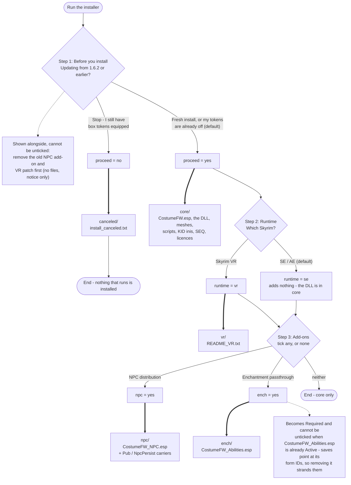

# FOMOD インストーラのフロー（1.6.3）

隣の `ModuleConfig.xml` から起こしたもの。**XML を変えたらここも直すこと。**

このファイルは配布物に入らない。`tools/package_fomod.ps1` は `fomod/` から
`info.xml` と `ModuleConfig.xml` だけを明示的にコピーする。意図的なので、
「README が抜けている」と思って追加しないこと。

FOMOD の構造は **質問がフラグを立て、フラグがフォルダを選ぶ** の2段。
図の太い矢印（`==>`）がファイルを落とす経路で、4本しかない。

## 読むときの要点

**`requiredInstallFiles` は空。** どの太矢印も通らなければ何も入らない。`core`
すら `proceed = yes` にぶら下げてある。ここを埋めると「止まれ」を選んだ人にも
動く mod が乗ってしまい、**その人が直しに戻るはずの旧版を上書きする。**

**SE を選んでも何も増えない。** DLL は `core` に1本で SE / AE / VR 共通
（`REL::Module::IsVR()` で分岐する CommonLibSSE-NG の1バイナリ）。
それでも質問を残しているのは、**VR ユーザーに SkyrimVRESL と ImGui VR Helper を
伝える場所がここしかない**から。SE で入れて後から VR に移った人が、
提示されなかったファイルを欠く状態にもならない。

**`Stop` も「インストール」である。** FOMOD に中止の概念は無い。できるのは
「動かないものを入れる」ところまで。**だから MO2 で "Replace" を選ばれると、
止めたつもりが旧版を消す。**選ぶ前に効く場所（Stop の選択肢の説明）に警告を
置き、`install_canceled.txt` にも復旧手順を書いてある
（2026-09-14、リリース前レビュー P1-a）。

**破線2本はファイルを動かさない。** 片方は更新者への注意書き、もう片方は
既に付呪 ESP を使っている人からチェックボックスを取り上げる条件
（`fileDependency file="CostumeFW_Abilities.esp" state="Active"` → `Required`）。
MO2 実機で3ケースとも確認済み（2026-09-14）。

## 検証済みの経路

| ケース | 結果 |
|---|---|
| Stop を選ぶ | `install_canceled.txt` のみ。esp も DLL も入らない |
| SE ＋ NPC ＋ 付呪 | esp 3本 ＋ SE の DLL（3,234,304）。README_VR.txt は入らない |
| 付呪 ESP が有効な状態で再インストール | Enchantment passthrough が Required になり外せない |
